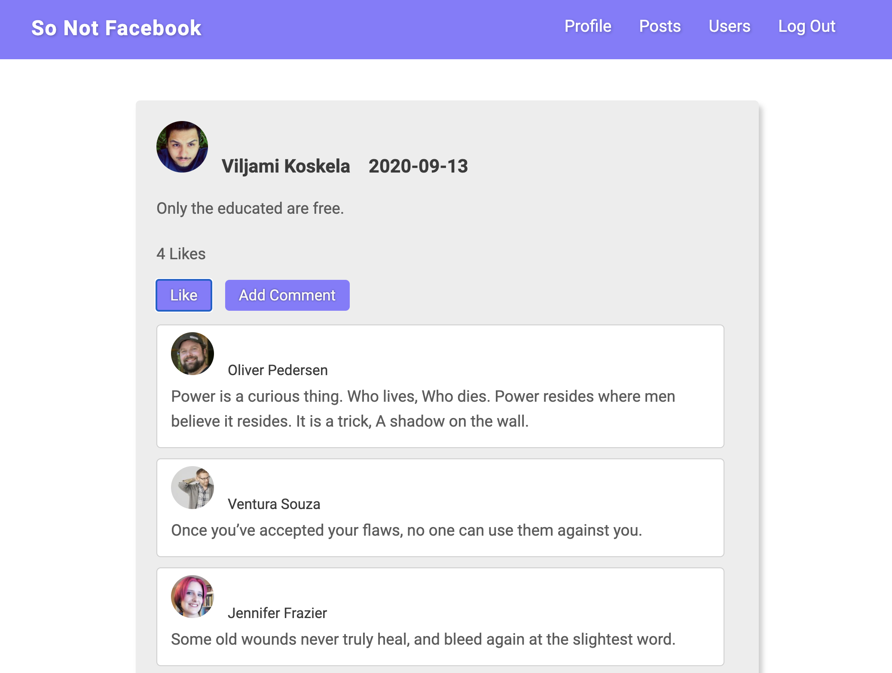
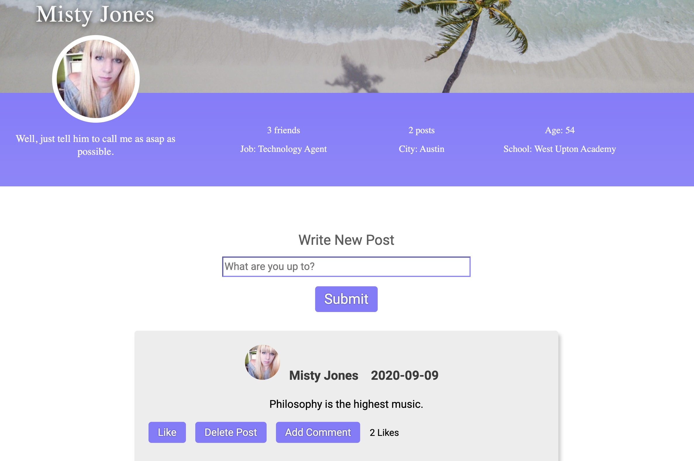

<h1>Facebook of 2010 Reimagined</h1>

Users can write a post, like a post, comment on a post, and reply to a comment.

Users can browse other users.

And of course, create their own custom profile.

 